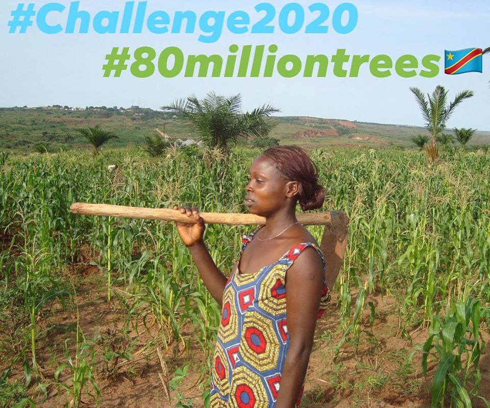

# Documenten en bestanden archief *Duurzame Korrewegwijk*

---
> Als het planten van bomen even winstgevend was als het produceren van wapens, dan zag de wereld groen in plaats van rot.
```
vrij naar Henri de Wolf (oprichter Forma Actua)
```
---


 *#80milliontrees - #challenge2020*

# Duurzame Korrewegwijk

*Duurzame Korrewegwijk* is een bewoners project/initiatief, met als doel het realiseren van een duurzame korrewegwijk. Het werd in 2012 ingediend als wijkstemdag project.

*Duurzame Korrewegwijk* is (momenteel) geen organisatie of stichting maar werkt samen met wijk- en buurtbewoners en hun organenen en andere organisaties die actief zijn in de wijk, die op het vlak van verduurzaming samen willen werken.

Op dit moment tracht *Duurzame Korrewegwijk* een project voor een groen dak & zonnepanelen installatie van de grond te krijgen (ism. *Grunneger Power* & werkgroep 'De Groene Korrewegwijk') voor huurcomplexen id Nieuw- en West- Indische buurt en mogelijk ook andere delen vd wijk waar voor zonnepanelen geschikte daken (platte daken) liggen. Voor woningen met een niet geschikt dak voor zonnepanelen, of waar ivm. kamerverhuur van de bovenverdieping eigenaar of huurder niet op eigen dak zonnepanelen kunnen nemen, kunnen panelen op daken van bedrijfspanden komen (via de postcode roos regeling).

## THEMA'S

Verdere thema's zijn:
* Afval, recycling & composteren - streven naar een afval-loze/plastic-loze wijk en meer bewoners die zelf composteren.
* Initiatieven tegen voedselverspilling.
* Bevorderen van duurzame mobiliteit en beter benutten van parkeer-gelegenheid door deel-auto gebruik te bevorderen en beter OV. Zoals het aanleggen van een duurzame tram zonder rails of bovenleiding (zie: [duurzame mobiliteit](https://github.com/duurzamekorrewegwijk/DuurzameKorrewegwijk/tree/master/doc/mobiliteit))
* Projecten om de bio-diversiteit in de wijk te verbeteren (insecten- en bijen-hotels, bijen en vlinder tuinen, etc.)
* Groene gevels, groene tegels en groene daken van gebouwen en bijgebouwen.
* Zonnepanelen op zoveel mogelijk gebouwen (woningen en bedrijfsgebouwen)
* Verduurzaming van de gebouwde omgeving

## DISCUSSIE

### Gasloos

Omdat het 'gasloos' beleid nu volop in discussie is (en binnenkort landelijk & gemeentelijk beleid dreigt te worden), hebben we een pagina aangemaakt met links naar artikelen over gasloos met de voors- en tegens van gasloos & alternatieven.

* [Discussie over 'gasloos'](doc/gasloos/README.md)

### Biomassa/bomen

AL geruime tijd woedt er de discussie over hoe duurzaam en CO2 neutraal biomassa nu is. Alsmede is er de discussie over het nut van bomenplanten als bijdrage aan klimaat beleid en tegengaan bodem-erosie en woestijnvorming. Artikelen hierover staan o de onderstaande pagina.

* [Bomen en biomassa](doc/bomen/README.md)

## DOCUMENTEN

[documentatie](doc/README.md)

## NIEUWS

[nieuws](doc/nieuws/README.md)

## CAMPAGNE

Duurzame Korrewegwijk lanceerde begin dit jaar de campagne voor een CO2 neutrale wijk. Deze campagne draait om de volgende doelstellingen:
* Terugdraaien van de subsidie voor biomassa (momenteel 11 miljard euro per jaar)
* Tegengaan van bomenkap
* Meer investeren in woningisolatie en verduurzaming van woningen
* Voor net iets meer dan 2 eurocent per kuub gas het gasgebruik compenseren door bomenaanplant projecten (overal ter wereld en volgens het Kyoto protocol) te steunen


## BIJDRAGEN

Wil je je eigen ideën hier kwijt, reageren/becommentariëren, stuur dan een mail naar:

duurzamekorrewegwijk@gmail.com
