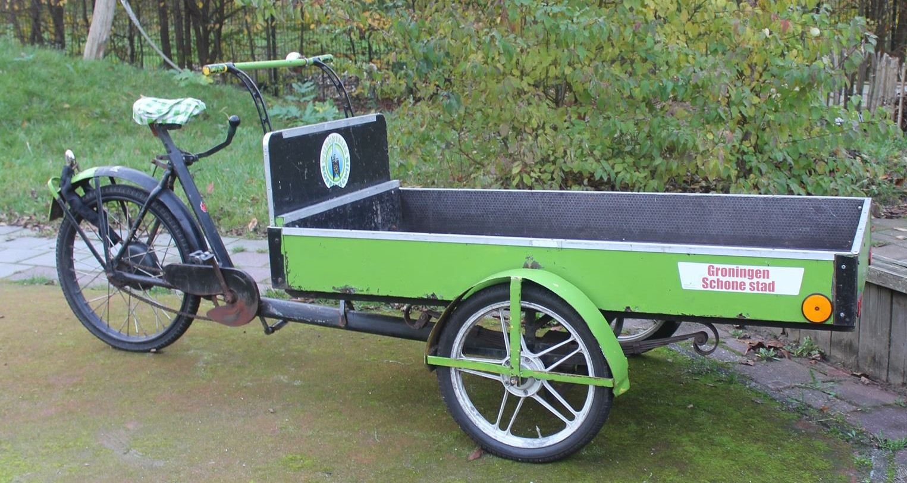

# Documenten en bestanden archief *Duurzame Korrewegwijk*

# Duurzame Korrewegwijk

*Duurzame Korrewegwijk* is een bewoners project/initiatief, met als doel het realiseren van een duurzame korrewegwijk. 

*Duurzame Korrewegwijk* is (momenteel) geen organisatie of stichting maar werkt samen met wijk- en buurtbewoners en hun organenen en andere organisaties die actief zijn in de wijk, die op het vlak van verduurzaming samen willen werken.

Op dit moment tracht *Duurzame Korrewegwijk* een project voor een groen dak & zonnepanelen installatie van de grond te krijgen (ism. *Grunneger Power*) voor huurcomplexen id Nieuw Indische buurt en mogelijk ook andere delen vd wijk waar voor zonnepanelen geschikte daken (platte daken) liggen.

Verdere thema's zijn:
* Afval, recycling & composteren - streven naar een afval-loze/plastic-loze wijk en meer bewoners die zelf composteren.
* Initiatieven tegen voedselverspilling.
* Bevorderen van duurzame mobiliteit en beter benutten van parkeer-gelegenheid door deel-auto gebruik te bevorderen.
* Projecten om de bio-diversiteit in de wijk te verbeteren (insecten- en bijen-hotels, bijen en vlinder tuinen, etc.)
* Groene gevels, groene tegels en groene daken van gebouwen en bijgebouwen.

DOCUMENTEN:

[documentatie](doc/README.md)

BIJDAGEN:

Wil je je eigen ideën hier kwijt, stuur dan een mail naar:
duurzamekorrewegwijk@gmail.com
