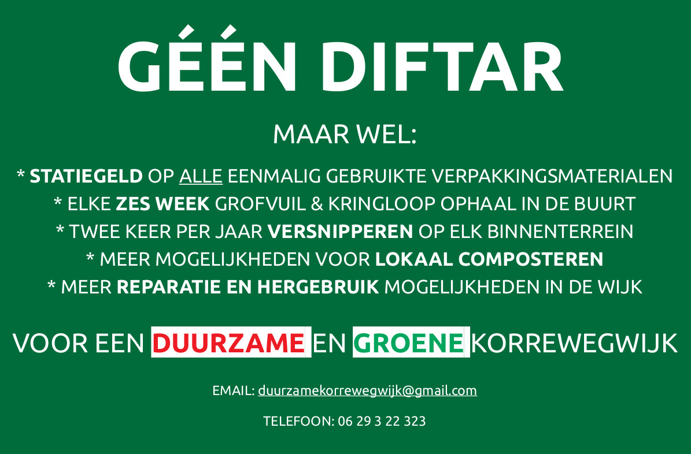
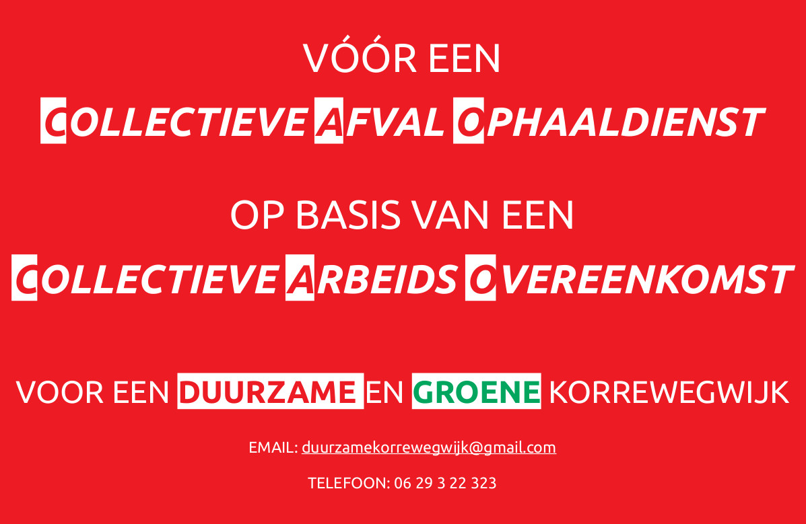

# Afval beleid

## Enquete

* [Afval & duurzaamheid enquete Korrewegwijk & De Hoogte/Selwerderwijken](afvalenquete.pdf)

## Rapporten & Notities

* [CPB rapport over Diftar](cpb-achtergronddocument-diftar-in-nederland-verschillen-tussen-oostenwest.pdf)
* [Afvalbeleid gemeente Groningen](Minder-afval-meer-grondstoffen-Op-weg-naar-een-circulair-Groningen.pdf)
* [Aantekeningen bij afvalbeleid](aantekeningen_afvalproblematiek_diftar.pdf)

## Nieuwsberichten

* [RTVNoord 'Denk goed na voor je in Groningen laat betalen per afvalbak of -zak' ](https://www.rtvnoord.nl/nieuws/218104/Denk-goed-na-voor-je-in-Groningen-laat-betalen-per-afvalbak-of-zak)
* [DvhN Stad Groningen dichter bij Diftar-afvalscheiding](https://www.dvhn.nl/groningen/Stad-dichter-bij-afvalscheiding-25265597.html)
* [Beijumnieuws: DIFTAR ZAL BEIJUM NOG MEER GAAN VERSMEREN](https://beijumnieuws.blogspot.com/2020/01/diftar-zal-beijum-nog-meer-gaan.html)
* [Beijumnieuws: diftar](https://beijumnieuws.blogspot.com/search?q=diftar&max-results=20&by-date=true)
* [OogTV: Diftar of niet, afvalstoffenheffing stijgt met bijna 14 procent](https://www.oogtv.nl/2020/07/diftar-of-niet-afvalstoffenheffing-stijgt-met-bijna-14/)

